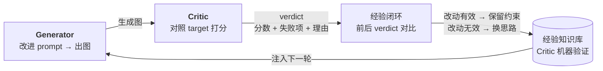
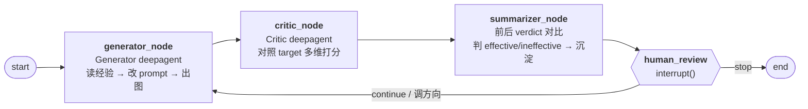
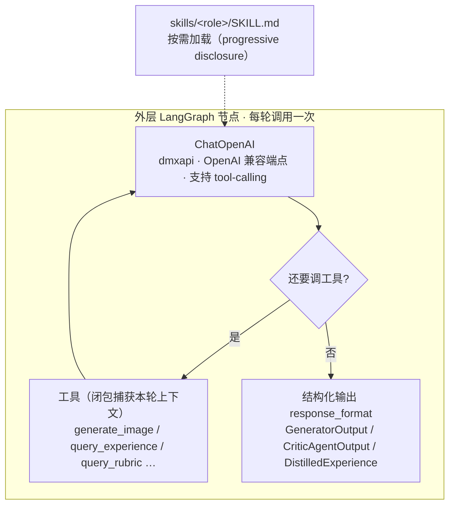
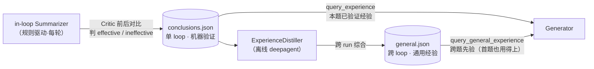
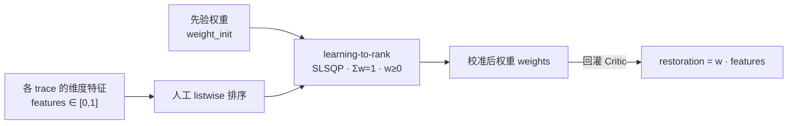

# img-iter-agent

> 把 GAN 的「生成—对抗」搬到 **Agent 层面**：不训练两个神经网络，而是让两个 LLM agent
> （生成方 vs 评判方）在一道考题上反复博弈，每轮改动由 Critic 客观判定有效/无效，沉淀为
> 可复用经验，驱动下一轮生成——直到还原度收敛。

一个**自我迭代的 AI 生图 Agent**：给定一张产品实物图 + 验收标准，自动在「**生成 → Critic 对抗评判 →
经验闭环验证 → 优化提示词**」的闭环里逐轮改进，逼近还原度最高的生图配置。首个落地场景是
**家具跨境电商白底产品图**（结构 / 材质 / 颜色最易翻车、退货主因）。

## 它解决什么

| 问题 | 解法 |
|---|---|
| 生图模型在结构 / 比例 / 材质 / 颜色上反复翻车 | Critic 对照参考图逐维度评判 → 把失败项反馈给 Generator，针对性改 prompt，逐轮收敛 |
| LLM 单轮打分有系统性偏差、不可信 | 混合评分：客观维度二分 ✓/✗（可复现）+ 渐变维度连续分；权重由人工排序校准吸收偏差 |
| 经验散落为单轮快照，无法复用 | Critic 驱动的经验闭环：每轮改动 → 前后 verdict 对比 → 判定有效/无效 → 沉淀进结构化知识库 |
| 单题经验无法跨题复用 | 独立经验蒸馏器跨 loop 归纳通用 dos/donts，作为先验回灌生成 |

## 核心原理

两个 agent 在「Critic 验证的经验知识库」上博弈与自我改进——Critic 是改动有效性的**客观裁判**，
其前后评分对比是经验沉淀的唯一证据。



> [!NOTE]
> 还原度不是 LLM 直接给一个数，而是 **restoration = w · features**：每个维度产出 `∈[0,1]` 的特征值
> （二分维度 = 通过率，连续维度 = LLM 分），加权求和。权重 `w` 由 benchmark 先验给出，再由人工排序校准更新。

## 架构

### 1. 自我迭代闭环（LangGraph）

一题一 loop：同一道考题只有一条 loop，再次运行会在原 loop 上**续跑**（轮数叠加）。每轮经过
四个节点，在 `human_review` 处 `interrupt()` 等人工裁决（continue / stop / 调方向），不自动收敛。



`SqliteSaver` 持久化每轮状态，可断点续跑；每个 loop 在 LangSmith 里是**一条 trace**（多轮 invoke 按 `loop_id` 聚合）。

### 2. Agent 即引擎（deepagents）

Generator / Critic / ExperienceDistiller 不是「单次 LLM 调用 + 手抠 JSON」，而是用官方
[`deepagents`](https://github.com/langchain-ai/deepagents)（`create_deep_agent`）构建的 **tool-using agent**，
嵌入外层 LangGraph 节点当「引擎」：每轮内部跑完一个「模型想 → 调工具 → 看结果 → 再想」的 ReAct 循环，
最后用 `response_format` 结构化输出交付。**新增策略 / 能力 = 新增工具，不改外层图。**



三个 agent 的配置（工具 / 模型 / 技能 / 输出）：

| Agent | 职责 | 模型（`IMG_ITER_*`） | 工具 | 结构化输出 | Skill |
|---|---|---|---|---|---|
| **Generator** | 构造/改进 prompt → 出图 | `generator_model`（文本即可） | `generate_image`、`query_experience`、`query_general_experience` | `GeneratorOutput{prompt, delta_note}` | `skills/generator` |
| **Critic** | 对照 target 多维打分 | `critic_model`（**必须多模态**） | `query_rubric`（按需查判定标准） | `CriticAgentOutput{dimensions}` | `skills/critic` |
| **ExperienceDistiller** | 跨 loop 蒸馏通用经验 | `summarizer_model` | `list_runs`、`query_run`、`query_dim_history`、`query_conclusions` | `DistilledExperience{summary, lessons}` | `skills/experience-distiller` |

> [!IMPORTANT]
> Critic 只输出**每维度的原始评分**，不算还原度——权重不在 agent 手上。代码侧用 `recompute_restoration`
> 把评分映射成 `DimensionScore` 再加权。这样「权重变更不影响打分」，闭环 B 的校准才能安全回灌。

> [!NOTE]
> in-loop **Summarizer** 是规则驱动（非 deepagent）：它直接对比前后 Critic verdict 判定有效/无效，
> 不依赖 LLM。每个 agent 跑飞时都退安全默认值，绝不中断闭环。

### 3. 经验闭环：两层知识

经验不是单轮事实快照，而是分两层沉淀：



- **`conclusions.json`**（每 run）：in-loop Summarizer 写。Critic 前后 verdict 对比**机器验证**的逐条结论
  （按 `(dim, change)` 的 effective / ineffective + `critic_evidence`）。
- **`general.json`**（按 bench 共享）：独立蒸馏器写。跨 run、LLM **综合**的上层通用经验，
  每条带 `dim / insight / dos / donts / evidence / confidence`。是 conclusions 的上层归纳。

蒸馏器以「已验证 effective/ineffective」为锚（比单看分数可靠），跨 run 找反复出现的有效/无效做法。

### 4. 评分校准（闭环 B）

另一个独立闭环：让 Critic 的还原度贴合人的判断。人只做**排序**（listwise，人擅长的），
`learning-to-rank` 拟合维度权重，天然修正 LLM 连续打分的系统性偏差。



| | 闭环 A：生成迭代 | 闭环 B：评分校准 |
|---|---|---|
| **目的** | 提升生成还原度 | 让 Critic 评判贴合人的判断 |
| **驱动** | Critic 多维分 + 人工审批 | 人工排序 vs Critic 初评 |
| **产出** | 更好的图 + 验证过的经验 | 校准后的维度权重 |

### 评分维度（首个 benchmark）

6 个维度，混合评分（二分 ✓/✗ → 通过率；连续 → LLM 0-1 分）：

| 维度 | 类型 | 先验权重 | 评什么 |
|---|---|---:|---|
| `consistency` | 二分 | 0.25 | 三视图跨张一致性（同产品 / 同色 / 几何比例一致） |
| `product_structure` | 二分 | 0.22 | 部件数 / 位置 / 形态正确，无缺失 / 重复 / 穿模 |
| `material_texture` | 连续 | 0.18 | 材质类型与还原程度（对照参考） |
| `color_accuracy` | 连续 | 0.13 | 与产品实物的色差程度 |
| `artifact_defect` | 二分 | 0.12 | 无变形 / 失真 / 模糊 / 伪影 / 悬浮 |
| `commercial_focus` | 二分 | 0.10 | 主体突出 / 白底干净 / 构图合规 |

## 快速开始

### 前置

- Python ≥ 3.11
- [uv](https://docs.astral.sh/uv/)（推荐）或 pip + venv
- [dmxapi](https://www.dmxapi.cn) 密钥（生图与评判的统一后端）

### 安装

```bash
git clone <repo> && cd img-iter-agent
uv sync                       # 或: python -m venv .venv && .venv/bin/pip install -e .
cp .env.example .env          # 填入 IMG_ITER_DMXAPI_KEY 与各 model_id
```

### 跑一个迭代闭环（CLI）

```bash
# 对 s001（双人床）跑闭环 A：生成→评分→经验验证→人工审批，逐轮 continue/stop
python -m img_iter_agent.cli run --bench furniture_product_whitebg --sample s001
```

### 蒸馏跨 loop 通用经验

跑过多个 sample 的 loop 后，用独立蒸馏器跨 loop 归纳通用经验（dos/donts）：

```bash
# 读该 bench 下所有 run 的 trajectory + 已验证结论 → 蒸馏 → data/experience/<bench>/general.json
python -m img_iter_agent.cli summarize --bench furniture_product_whitebg
```

产物 `general.json` 被 Generator 的 `query_general_experience` 工具读回，作为**跨题先验**注入下一轮生成。

### 启动可视化打分台（Web）

```bash
img-iter-web          # 或: python -m uvicorn img_iter_agent.web.app:app --port 8765
```

打分台提供 5 屏：总览（每个 sample 的 loop 状态）、loop 详情（迭代轨迹 + 经验沉淀）、trace 详情
（大图对照 target + Critic 明细）、人工排序（拖拽打分 → 自动校准权重）、Agent 设置（在线改系统提示词 + 模型 id）。

其它 CLI：`calibrate`（用人工排序拟合权重）、`analyze`（跨 run 汇总还原度 + 画图）。

## 配置

所有配置走环境变量（前缀 `IMG_ITER_`），见 `.env.example`：

- **dmxapi 凭证与地址**（`IMG_ITER_DMXAPI_HOST` / `IMG_ITER_DMXAPI_KEY`）
- **四个协议族的生图 model_id** —— dmxapi 聚合了四族差异，Router 按任务模式路由：

  | 族 | 协议 | 模型 | 用途 |
  |---|---|---|---|
  | A | OpenAI Images | `gpt-image-2` | 纯文生图（备选） |
  | B | 豆包 Responses | `seedream-5.0-pro` | 参考图风格迁移 / 纯文生图（默认优先） |
  | C | Qwen Responses | `qwen-image-2.0` | 纯文生图（备选） |
  | D | Gemini native | `gemini-3.1-flash-image` | 多轮改图（唯一支持） |

- **三个 agent 的推理 model_id**（`generator_model` / `critic_model` / `summarizer_model`），均走 dmxapi
  的 OpenAI 兼容端点（`/v1/chat/completions`，需支持 tool-calling；Critic 必须多模态）
- **LangSmith 追踪**（`LANGSMITH_*`，agent 运转可视化）

> [!TIP]
> Agent 的系统提示词外部化到 `data/agents_config/<role>.md`，可在 Web 台「Agent 设置」页在线编辑；
> 更长的诀窍 / 流程沉淀在 `skills/<role>/SKILL.md`，由 agent 按需加载。

## 数据布局

```
data/
├── benchmarks/                     # 〔你准备的考题 · ✅入 git · 跨 run 复用〕
│   └── furniture_product_whitebg/
│       ├── manifest.json           # 6 维评分定义 + 权重先验
│       ├── rubric.md               # 各维度判定细则
│       └── samples/sNNN/           # target.png(参考锚) + content_spec.json(约束 + checklist)
├── runs/<bench>-<sample>/          # 〔系统产出 · ❌不入 git〕 一题一 loop
│   ├── trajectory.jsonl            # 完整轨迹（每轮含 prompt / verdict / delta_note）
│   ├── lessons/conclusions.json    # 单 loop 经验（Critic 机器验证）
│   ├── out/aNNN/                   # 每轮生成图
│   └── calibrated_weights.json     # 校准后权重
├── experience/<bench>/             # 〔跨 loop 通用经验 · ❌不入 git〕
│   └── general.json                # 蒸馏出的 dos/donts（多 run 综合）
└── analyses/                       # 〔离线分析 · 只读〕
```

> [!NOTE]
> 你唯一需要手动管理素材的地方是 `data/benchmarks/<bench>/samples/`——放产品实物图
> `target.png` + 写 `content_spec.json`（要生成什么、约束、各维度 checklist）。系统跑出来的产物自动进 `data/runs/`。

## 测试

```bash
python -m pytest          # 98 个测试（deepagent 路径、经验闭环、跨 loop 蒸馏、混合评分、权重校准）
ruff check src/ tests/    # 代码风格
```

基础层测试无需任何密钥——离线、用 `FakeToolCallingChatModel` 驱动 agent 路径。

## 项目结构

```
src/img_iter_agent/
├── agents/
│   ├── generator.py             # 生成方 deepagent：改 prompt + 经验注入（产出 delta_note）
│   ├── critic.py                # 评判方 deepagent：多模态混合评分
│   ├── summarizer.py            # in-loop 总结：规则驱动，前后 verdict 对比判有效/无效
│   ├── experience_distiller.py  # 独立总结方 deepagent：跨 loop 蒸馏通用经验
│   ├── _agent_output.py         # deepagent 的结构化输出 schema
│   └── tools/                   # 工具注册中心（= 策略/能力扩展点）
├── pipeline/
│   ├── graph.py                 # LangGraph 闭环：generator→critic→summarizer→human_review(interrupt)
│   ├── runner.py                # build_loop_context：构造 agent + checkpointer + 标准 config
│   └── state.py                 # 跨轮 State
├── llm/chat_model.py            # build_chat_model → ChatOpenAI（指向 dmxapi，支持 tool-calling）
├── generation/
│   ├── router.py                # 按「任务模式 + model_hint」路由到协议族 dispatcher
│   └── protocols/               # 屏蔽四族差异：A(OpenAI)/B(豆包)/C(Qwen)/D(Gemini)
├── memory/
│   ├── knowledge.py             # 单 loop 经验库（conclusions.json + Critic 驱动 status 判定）
│   ├── experience.py            # 跨 loop 通用经验库（general.json 读写 + schema）
│   └── schema.py                # Pydantic v2 数据契约
├── calibration/                 # 闭环 B：排序拟合权重（learning-to-rank, SLSQP）
├── data/                        # 三层数据管理 + trajectory.jsonl（可独立加载重放）
└── web/                         # FastAPI 打分台（前后端解耦，Vanilla JS 前端）
```

**关键设计**：dmxapi 聚合 API（全云端，屏蔽 4 协议族）· LangGraph 编排（闭环原生 + 断点续跑）·
deepagents 引擎（tool-using agent + 结构化输出）· 混合评分（二分可复现 + 连续保渐变）·
三层数据分离（benchmarks / runs / experience）· 图片全程用文件路径（不用 base64）。

## 文档

- **[docs/ARCHITECTURE.md](docs/ARCHITECTURE.md)** — 完整架构与 10 条 ADR（关键决策记录）
- **[docs/EVALUATION.md](docs/EVALUATION.md)** — 混合评分与排序校准的方法论
