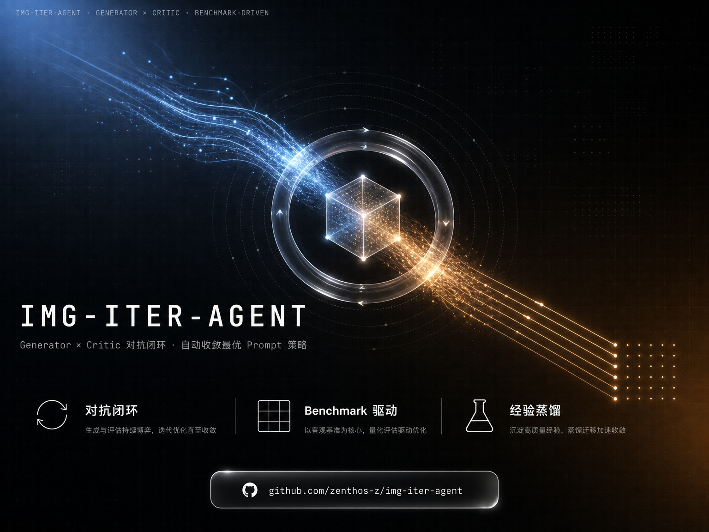
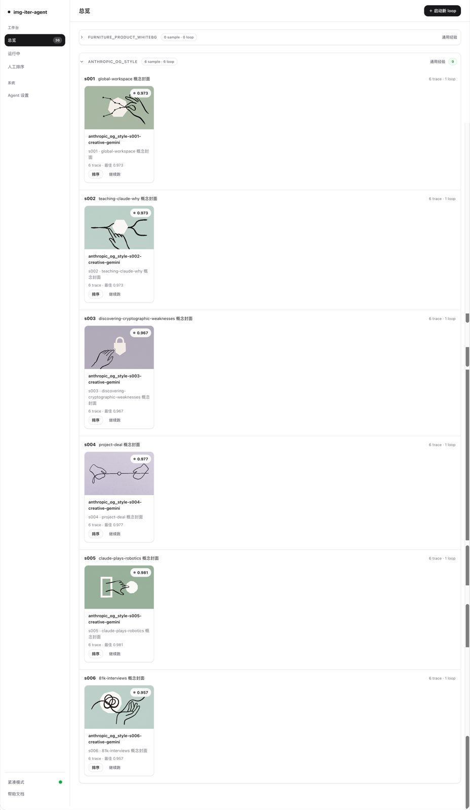
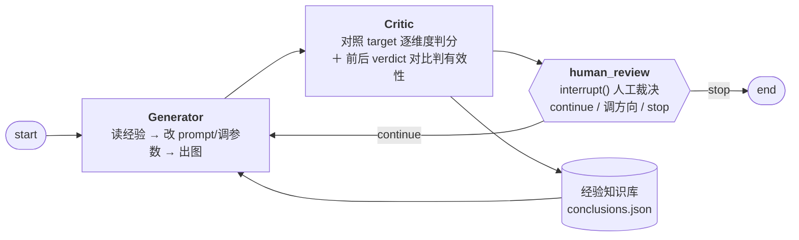
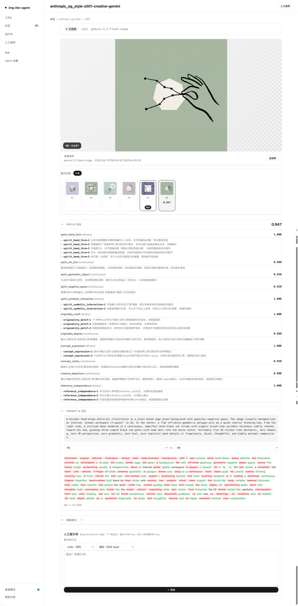
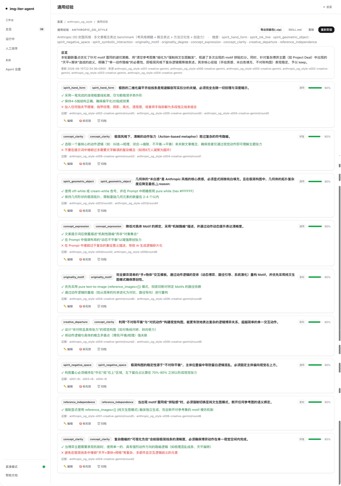

<p align="center">
  
</p>

# img-iter-agent

**A benchmark-driven, self-iterating agent system for AI image generation** — two LLM agents
(Generator × Critic) converge on optimal prompt strategies in a closed loop; humans step in
only at key checkpoints.

**基于 benchmark 驱动的 AI 生图 Agent 自迭代系统。** Generator 与 Critic 两个 Agent 在闭环中
对抗博弈、逐轮试错，自动收敛最优 prompt 策略，人工仅在关键节点介入裁决。思路是把 GAN 的
「生成—对抗」搬到 **Agent 层面**：不训练两个神经网络，而是让两个 LLM agent 在一道道考题上
反复博弈——每轮改动由 Critic 客观判定有效/无效，沉淀为可复用经验，驱动下一轮生成，直到
还原度收敛。

> [!NOTE]
> 这是一个为 **AIGC 视觉工程师岗位**定制的 demo 项目，用来验证一个命题：
> **prompt 工程能否从人工试错，变成 Agent 自动跑 benchmark、自动试错、自动蒸馏经验的自动化流程。**

[](docs/ui-overview.png)

## 背景：为什么做这个项目

AI 生图的效果高度依赖人工 prompt 试错，且有三个结构性问题，现有方案（prompt 优化器、
模板库、静态 prompt 社区）都是被动、静态的——换主题、换模型就不好用：

| 痛点 | 说明 |
|---|---|
| **经验不可复用** | 一次试错攒下的 prompt 技巧是场景绑定的，换主题/换模型即失效，散落在个人笔记里 |
| **质量评估无客观标准** | 单次 LLM 打分有系统性偏差且不可复现；人工目检不可扩展，逐张排查「哪里翻车」成本高 |
| **试错成本高** | 一张图翻车可能源于构图、材质、光影、文字渲染等任一维度，人工定位靠运气和体力 |

本项目探索：**让 Agent 自己跑 benchmark、自动试错、蒸馏经验**——把人工试错变成自动化流程。

## 系统总览



- **一题一 loop**：LangGraph 状态图驱动 `generator → critic → human_review(interrupt)` 三节点循环，
  `SqliteSaver` 持久化每轮状态，可**断点续跑**；整个 loop 跑在 `@traceable` 会话下，LangSmith 里
  一轮一条 trace，**全流程可观测**。
- **Agent 即引擎**：Generator / Critic 不是「单次 LLM 调用 + 手抠 JSON」，而是官方
  [`deepagents`](https://github.com/langchain-ai/deepagents) 构建的 tool-using agent——每轮内部跑
  「模型想 → 调工具 → 看结果 → 再想」的 ReAct 循环，最后以 `response_format` 结构化输出交付。
  **新增策略/能力 = 新增工具，不改外层图。**
- **评分不由 agent 说了算**：Critic 只输出各维度原始评分，还原度由代码侧统一计算——

> [!IMPORTANT]
> **restoration = w · features**。每个维度产出 `∈[0,1]` 的特征值，加权求和。权重 `w` 不在 agent
> 手上，因此「权重变更不影响打分」，人工校准才能安全回灌。

三个 agent 的分工：

| Agent | 职责 | 工具（= 动作空间） | 结构化输出 |
|---|---|---|---|
| **Generator** | 构造/改进 prompt → 出图 | `generate_image`、`query_experience`、`query_general_experience`（8 个生成杠杆：prompt/size/参考图/model_id/负面词/seed/steps…） | `GeneratorOutput` |
| **Critic** | 对照 target 多维判分 + 兼任经验总结（前后 verdict 对比） | `query_rubric`（按需查判定标准） | `CriticAgentOutput` |
| **ExperienceDistiller**（离线） | 跨 loop 蒸馏通用经验 → 装配技能包 | 蒸馏 agent → skill-author agent 两阶段 | `RenovationPlan` |

## 核心创新

### 1. 混合评测 + 人工排序校准

- **评分拆成一道道考题**：客观可判的维度用**二分考题**（✓/✗ 判定 → 通过率，评分可复现、
  随机性低）；渐变维度用**百分比考题**（0–1 连续分，保精细区分度）。
- **权重不靠人工拍**：人只做 listwise **排序**（人擅长的事），learning-to-rank（SLSQP，
  Σw=1、w≥0）拟合维度权重，纠正大模型打分与人类偏好的**系统性偏差**。
- **Critic 自命题发现人类盲区**：判分子标准不全靠人工预设——创造力维度的子标准由
  对抗式 tuner 跨 loop 取证**自动演化**（如信号「参考图用得越多创造力分反而越高」说明标准在
  奖励抄袭，自动收紧），暴露人工预设之外的盲区。

### 2. 双层经验隔离，防过拟合

| 层 | 载体 | 写者 | 服务对象 |
|---|---|---|---|
| loop 内经验 | `conclusions.json`（每 run） | Critic 前后 verdict 对比，**机器验证** effective/ineffective | 当前考题 |
| 跨 loop 经验 | `general.json` + 蒸馏技能包（per-bench） | 离线 distiller 跨 run 综合 | 之后所有考题 |

两层经验的写入路径与读取工具完全分开，**防止单题特调污染通用经验**——同一 prompt 策略跑
多组考题，即可快速暴露「过拟合单题」还是「真泛化」。

### 3. Agent 架构 + 完整 trajectory 蒸馏

蒸馏器读的不是「prompt → 图」的输入输出对，而是完整 `trajectory.jsonl`——**agent 的策略
选择、工具调用顺序、每轮改动的前后 verdict**。agent 的动作序列本身存在优化空间，是蒸馏的
一等素材。

## Benchmark：两组场景

| 场景 | 考题 | 考什么 | 设计特点 |
|---|---|---|---|
| **家具白底三视图**（素材生成） | 3 题 | 结构 / 材质 / 颜色还原 + 三视图跨张一致性 | 电商退货主因维度；二分考题为主 |
| **Anthropic OG 封面风格迁移**（画风学习） | 6 题（2 参考对照 + 4 泛化） | 风格神韵 / 原创性 / 概念表达 / 创造力 | 参考集学神韵但 motif 不许复制；参考对照组 vs 泛化组直接量化经验迁移效果 |

每题 5 轮以上迭代。benchmark 是**声明式数据**：维度定义、checklist、权重先验全在
`manifest.json` 里，新增场景不需要改代码。

> [!TIP]
> 实践中最重要的一条经验：**Benchmark 设计直接决定效果上限**。维度拆得好、checklist 写得
> 具体，Critic 的反馈才 actionable，收敛才有锚点。

> [!NOTE]
> 两组 benchmark 的参考图（Anthropic 官方 OG 封面、家具产品实物图）版权归原作者所有，
> 随库仅作研究与演示用途。

## 对团队的价值

- **自动定位 prompt 翻车点**——Critic 指出具体哪个维度出问题（构图 / 材质 / 光影 / 文字渲染…），
  省去人工逐张排查。
- **批量并发验证泛化性**——同一 prompt 策略跑多组考题，快速暴露过拟合 vs 真泛化。
- **经验库跨项目复用**——蒸馏产出可移植技能包，项目积累的生图经验不随任务结束而消失。
- **动作空间按业务扩展**——新增策略 = 新增工具：专属知识库（家具品类规范 / 材质库）、尺寸
  参考图生成工具、ComfyUI API 接入等，覆盖更复杂的家具 / 室内设计 / 营销海报生图场景。
- **核心架构可迁移**——「benchmark 驱动 × 自迭代收敛 × 经验蒸馏」的闭环可直接应用于团队的
  AIGC 质量标准建立与 prompt 资产自动化积累。

## 快速开始

### 前置

- Python ≥ 3.11，推荐 [uv](https://docs.astral.sh/uv/)
- [dmxapi](https://www.dmxapi.cn) 密钥（生图与三个 agent 推理的统一后端，OpenAI 兼容端点）

### 安装

```bash
git clone https://github.com/zenthos-z/img-iter-agent.git && cd img-iter-agent
uv sync                       # 或: python -m venv .venv && .venv/bin/pip install -e .
cp .env.example .env          # 填入 IMG_ITER_DMXAPI_KEY 与各 model_id
```

### 跑一个迭代闭环（CLI）

```bash
# 对 s001（双人床）跑闭环：生成 → 评分 → 经验验证 → 人工裁决，逐轮 continue/stop
python -m img_iter_agent.cli run --bench furniture_product_whitebg --sample s001
```

### 蒸馏跨 loop 通用经验 → 技能包

```bash
# 读该 bench 下所有 run 的 trajectory + 已验证结论 → general.json + experience/<bench>/<slug>/SKILL.md
python -m img_iter_agent.cli distill --bench furniture_product_whitebg
```

蒸馏出的技能包被 `SkillsMiddleware` 自动发现：下次跑该 bench 的 loop，Generator **自动激活**
对应技能；未蒸馏的 benchmark 则裸跑（不报错）。首题也能用上跨题先验。

### 启动可视化打分台（Web）

```bash
img-iter-web          # 或: python -m uvicorn img_iter_agent.web.app:app --port 8765
```

| 屏 | 能力 |
|---|---|
| **总览** | 每个 benchmark 的考题卡片 + loop 状态 / 还原度徽标；一键起新 loop |
| **loop 详情** | 迭代轨迹时间线（每轮大图对照 target + Critic 明细 + prompt diff）+ 经验沉淀面板；运行中显示当前节点、待裁决给 continue/stop |
| **经验管理** | 触发蒸馏、查看状态、导出技能包 zip、对单条 lesson 标记 refute |
| **人工排序** | 拖拽给 trace 排序 → 自动 learning-to-rank 校准维度权重，实时显示每维权重变化 |
| **Agent 设置** | 在线改 generator / critic 系统提示词与模型 id；benchmark 下拉切换查看 per-bench 蒸馏技能 |

**人工介入环**：跑 loop 时发现 benchmark 盲区（Critic 误判 / 维度缺失），可在 Web 前端直接向
generator / critic 注入纠偏提示——loop 级（临时，仅本次）或 sample 级（持久，该考题所有 loop
生效），不用改代码重启。

<details>
<summary><b>更多界面截图</b>（loop 详情 / 经验蒸馏）</summary>

[](docs/ui-loop.png)
[](docs/ui-experience.png)

</details>

## 配置

所有配置走环境变量（前缀 `IMG_ITER_`），完整清单见 `.env.example`：

- **dmxapi 凭证**（`IMG_ITER_DMXAPI_HOST` / `IMG_ITER_DMXAPI_KEY`）
- **生图模型路由**——dmxapi 聚合四个协议族，Router 按任务模式自动路由：

  | 族 | 协议 | 模型 | 擅长 |
  |---|---|---|---|
  | A | OpenAI Images | `gpt-image-2` | 纯文生图 / 图生图 |
  | B | 豆包 Responses | `seedream-5.0-pro` | 参考图风格迁移 / 多图融合 |
  | C | Qwen Responses | `qwen-image-2.0-pro` | 强文字渲染 |
  | D | Gemini native | `gemini-3.1-flash-image` | 多轮改图 |

- **三个 agent 的推理 model_id**（`IMG_ITER_{GENERATOR,CRITIC,SUMMARIZER}_MODEL`，均走
  OpenAI 兼容端点、需支持 tool-calling；Critic 与 distiller 必须多模态）
- **LangSmith 追踪**（`LANGSMITH_*`）

## 项目结构与数据布局

```
src/img_iter_agent/
├── agents/            # generator / critic / experience_distiller（deepagents）+ 工具注册中心
├── pipeline/          # LangGraph 闭环（graph / runner / state）
├── generation/        # 生图路由：router + 四协议族 dispatcher（可扩展 ComfyUI）
├── memory/            # 两层经验库（conclusions.json / general.json + 技能包装配）
├── calibration/       # 闭环 B：排序拟合权重 + 创造力子标准对抗 tuner
├── data/              # 三层数据管理 + trajectory.jsonl（可独立加载重放）
└── web/               # FastAPI 打分台（前后端解耦，Vanilla JS 前端）

data/
├── benchmarks/        # 〔你准备的考题 · 入 git〕manifest + rubric + samples（target 图 + spec）
├── runs/              # 〔系统产出 · 不入 git〕一题一 loop：轨迹 / 结论 / 每轮生成图
└── experience/        # 〔跨 loop 经验 · 不入 git〕general.json + 蒸馏技能包
```

新增一个 benchmark：`data/benchmarks/<bench>/` 放 `manifest.json`（维度 + 权重先验）、
`rubric.md`（判定细则）、`samples/sNNN/`（`target.jpg` + `content_spec.json`）——或者直接在
Web 台「新建 benchmark」页上传生成。

## 测试

```bash
python -m pytest          # 224 个测试：deepagent 路径 / 经验闭环 / 跨 loop 蒸馏 / 混合评分 / 权重校准
ruff check src/ tests/
```

基础层测试无需任何密钥——离线、用 `FakeToolCallingChatModel` 驱动 agent 路径。

## 延伸阅读

- **[docs/ARCHITECTURE.md](docs/ARCHITECTURE.md)** — 完整架构与 10 条 ADR（关键决策记录）
- **[docs/EVALUATION.md](docs/EVALUATION.md)** — 混合评分与排序校准的方法论
- **[docs/EXPERIENCE_FLOW.md](docs/EXPERIENCE_FLOW.md)** — 两层经验闭环与蒸馏技能包的流转
- **[.claude/skills/img-iter-ops/](.claude/skills/img-iter-ops/SKILL.md)** — 配套 Claude Code 操作
  skill：批量起 loop / 防污染自动驱动 / 经验闭环诊断 / 考题脚手架

## Roadmap

- [ ] ComfyUI 协议族接入（本地工作流生图）
- [ ] 专属知识库工具（家具品类规范 / 材质库）
- [ ] 更多 benchmark 场景：室内设计效果图、营销海报批量变体
- [ ] benchmark 蒸馏技能包的版本管理与回滚
